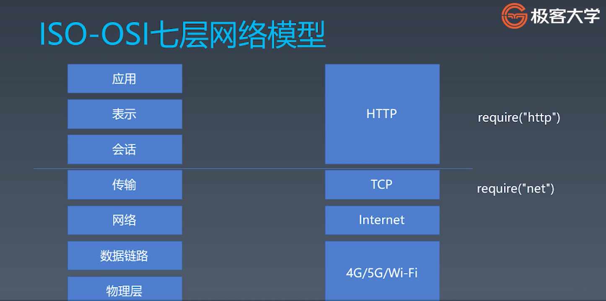
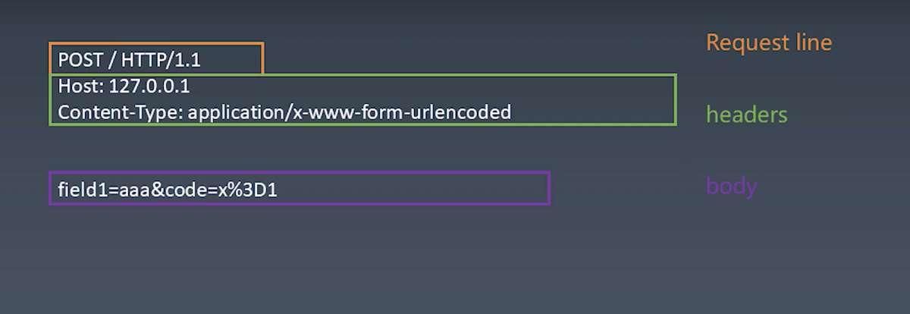
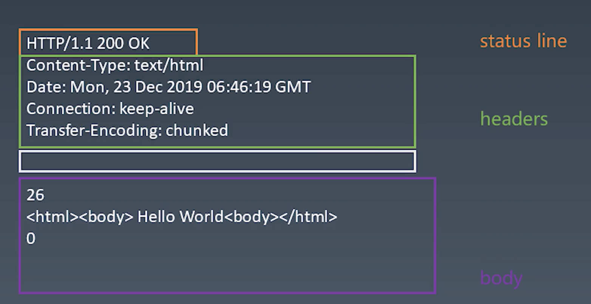

浏览器是由以下5个步骤完成的整体渲染:
 
  
css computing：DOM树上对应着哪些css规则，哪些css规则会发生叠加、会发生覆盖，把最终的结果计算出来，这就是css computing.
layout：通过layout步骤，把这颗DOM树上的所有元素产生的盒的位置计算出来。（其实获得位置的不是DOM元素本身，而是CSS最后生成的盒）
   
正则表达式大部分时候是可以用有限状态机去实现的。  

# TCP
ISO-OSI七层网络模型：
 

在TCP层，传输数据的概念是流

端口：每一个软件都会去从网卡拿数据，计算机的网卡是根据端口把接到的数据包分给各个应用的。

libnet/libpcap：对应IP协议的一些底层库，在node里面没有，但是node底层肯定要调到C++的这两个库。libnet负责构造IP包并且发送，labpcap负责从网卡抓所有流经你网卡的IP包。

  
# HTTP

HTTP协议是文本型的协议，文本型的协议一般来说是跟二进制型的协议相对的。文本型的协议就意味着这个协议里面所有的内容都是字符串。

HTTP协议的request部分： 
 
 
 body部分是由Content-Type来决定的，Content-Type规定了什么格式，body就用什么格式来写。

 所有HTTP里面的换行，按照规定都是\\r\\n，它是两个字符组成的一个换行符。

 - Content-Type是一个必要的字段，要有默认值
 - body是KV格式
 - 不同的Content-Type影响body的格式

 ## Response
 HTTP协议的Response部分： 
  

301/302/303都表示重定向
- 301：永久重定向（moved permanently），表示请求的资源分配了新url，以后应使用新url。
- 302：临时性重定向（found），请求的资源临时分配了新url，本次请求暂且使用新url。302与301的区别是，302表示临时性重定向，重定向的url还有可能还会改变。
- 303：表示请求的资源路径发生改变，使用GET方法请求新url。她与302的功能一样，但是明确指出使用GET方法请求新url。
- 304：Not Modidied，304虽然属于3xx类别中，但是和重定向没有关系。s当浏览器拿到状态码是304 的时候，就会从本地资源中拿请求的资源或者代理服务器直接返回本地的资源，304属于走缓存
- 400 bad request，表示请求的报文中存在语法错误，比如url含有非法字符。

  
### 第一步 HTTP请求总结
- 设计一个HTTP请求的类
- content type是一个必要的字段，要有默认值
- body是KV格式
- 不同的content-type影响body的格式

### 第二步 send函数总结
- 在Request的构造器中搜集必要的信息
- 设计一个send函数，把请求真实发送到服务器
- send函数应该是异步的，所以返回Promise

### 第三步 发送请求
- 设计支持已有的connection或者自己新建connection
- 收到数据传给parser
- 根据parser的状态resolve Promise

### 第四步 ResponseParser总结
- Response必须分段构造，所以要用一个ResponseParser来“装配”
- ResponseParser分段处理ResponseText，我们用状态机来分析文本的结构

### 第五步 BodyParser总结
- Response的body可能根据Content-Type有不同的结构，因此我们会采用子Parser的结构来解决问题
- 以TrunkedBodyParser为例，我们同样用状态机来处理body的格式
