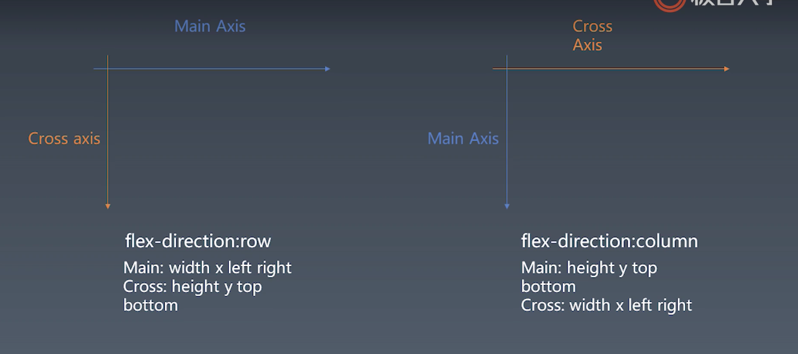

### css三代排版技术
- 第一代：正常流， 包含了position、display、float等等一系列的属性
- 第二代：flex
- 第三代： grid，一种更强大的排版模式
- CSS Houdini隐隐让大家感受到第四代的味道

### flex主轴_交叉轴属性

  

- flex分行
   - 根据主轴尺寸，把元素进行分行
   - 若设置了no-wrap，则强行分配进第一行

  

- 计算主轴方向
   - 找出所有flex元素
   - 把主轴方向的剩余尺寸按比例分配给这些flex元素
   - 若剩余空间为负数，所有flex元素为0，等比压缩剩余元素
   - 如果没有flex元素，则会根据justifyContent规则计算每个元素的位置

 

- 计算交叉轴方向
   - 根据每一行中的最大元素尺寸计算行高
   - 根据行高flex-align和item-align，确定元素具体位置

  

### 绘制总结
#### 第一步总结（绘制单个元素）
- 绘制需要依赖一个图形环境
- 我们这里采用了npm包images
- 绘制在一个viewport上进行
- 与绘制相关的属性：background-color、border、background-image等