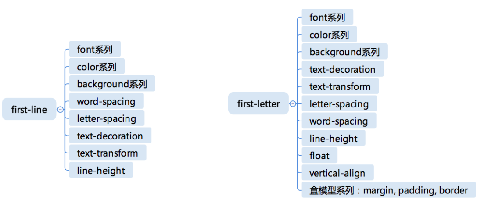

## CSS2.1的语法
- https://www.w3.org/TR/CSS21/grammar.html#q25.0
- https://www.w3.org/TR/css-syntax-3

 

## CSS总体结构
- @charset
- @import
- rules
   - @media
   - @page
   - rule

## At-rules
- @charset ： https://www.w3.org/TR/css-syntax-3/
   - 声明CSS的字符集。也基本上不用了
- @import ：https://www.w3.org/TR/css-cascade-4/
   - 大多数时候也不会用的
- @media ：https://www.w3.org/TR/css3-conditional/
   - （重要）
- @page ： https://www.w3.org/TR/css-page-3/
- @counter-style ：https://www.w3.org/TR/css-counter-styles-3
   - 只有在写列表的时候，而且需要定制这个列表的形状的时候我们才会去用
- @keyframes ：https://www.w3.org/TR/css-animations-1/
   - （重要）
   - 定义动画用的
- @fontface ：https://www.w3.org/TR/css-fonts-3/
   - （重要）
   - 就是著名的我们用的web font的功能，fontface可以用来定义一切字体，也不一定是web font，由此衍生出来一个技巧，叫icon-font
- @supports ：https://www.w3.org/TR/css3-conditional/
   - 它用来检查某些css的功能存不存在。基本上不推荐用supports来检查CSS的兼容性，我们完全可以去用一些工程工具去处理support
- @namespace ：https://www.w3.org/TR/css-namespaces-3/
   - 在极端情况下，我们做一个补充去用

 

 **@media、@keyframes、@fontface，这三个是非常重要的功能，是我们一定要去展开去掌握的。**

  

# CSS规则
- 选择器
- 声明
   - Key
   - Value

- Selector
   - https://www.w3.org/TR/selectors-3/  （实现的比较好）
   - https://www.w3.org/TR/selectors-4/  (标准制定的途中)
- Key
   - Properties
   - Variables: https://www.w3.org/TR/css-variables/
- Value
   - https://www.w3.org/TR/css-values-4/   

  

# 选择器语法
- 简单选择器
   - \*  &nbsp;&nbsp;&nbsp;&nbsp;--:通用选择器，可以选中任何元素，相当于没有选择器
   - div  svg|a  &nbsp;&nbsp;&nbsp;&nbsp;--：类型选择器，选择的是tagName属性
      - HTML是有命名空间的，主要的有三个：HTML、SVG、MathML。如果想选SVG或MathML里面的特定的元素，要用到单竖线|，单竖线是命名空间分隔符。在HTML里面命名空间分隔符是冒号，在CSS选择器里分隔符是单竖线。namespace要用@namespace去声明一下
   - .cls
   - #id
   - [attr=value]
   - :hover  &nbsp;&nbsp;&nbsp;&nbsp;--：伪类选择器
   - ::before  &nbsp;&nbsp;&nbsp;&nbsp;--：伪元素选择器

    

- 复合选择器(combined)
   - <简单选择器><简单选择器><简单选择器>
      - 简单选择器挨着写，就变成了复合选择器，它的语义是必须同时match这几个简单选择器，是与(&&)的关系。
   - \* 或者 div 必须写在最前面
      - 符合选择器有一个要求，\* 或者div必须写在最前面，伪类伪元素要写在最后面。
- 复杂选择器
   - <复合选择器>\<sp\><复合选择器>
      - 用空格分隔，表示子孙选择器。可以是父级，或者父级的父级。
   - <复合选择器>">"<复合选择器>
      - 父子选择器，必须是直接的父元素。
   - <复合选择器>"~"<复合选择器>
   - <复合选择器>"+"<复合选择器>
   - <复合选择器>"||"<复合选择器>
      - Selector Level4才有的，做表格table的的时候，表示可以选中某一个列。

 复杂选择器还可以用逗号相连接，构成一个选择器列表，逗号之间是或(||)的关系。     

优先级的计算：specificity是一个四元组[inline, id, class, tagName],依次优先级会下降。（具体见week7笔记）

示例：
- div#a.b .c[id=x]  &nbsp;&nbsp;&nbsp;[0, 1, 3, 1] 
- #a:not(#b) &nbsp;&nbsp;&nbsp;[0, 2, 0, 0]
- \*.a        &nbsp;&nbsp;&nbsp;[0, 0, 1, 0]
- div.a   &nbsp;&nbsp;&nbsp;[0, 0, 1, 1]

  

# 伪类
- 链接/行为
   - :any-link
      - 匹配所有的超链接，:link匹配的是还没有访问过的超链接
   - :link :visited
      - :link匹配的是还没有访问过的超链接，:visited匹配已经访问过的超链接， :link + :visited = :any-link
      - 一旦使用了:link或者:visited之后，就再也没有办法对里面的元素更改属性了(除了文字颜色之外)
   - :hover
   - :active
   - :focus
   - :target
      - 表示链接到当前的目标，是给作为锚点的a标签使用的。就是当前的HASH如果指向了当前的a标签所表示的链接，那么它就会激活target伪类。

- 树结构
   - :empty
      - 表示元素是否有子元素
   - :nth-child()
      - 表示这个元素是父元素的第几个child。是一个比较复杂的选择器，推荐用简单地方式来用，不要写比较复杂的语法表达式，比如只用来处理：奇偶，逢三个多一个、逢四个多一个等等。
   - :nth-last-child()
      - 破坏了CSS回溯原则，在早期的浏览器实现的并不好，在后期也是通过一定的骇客手段，强行的写代码去处理逻辑，然后才能够得以实现的
   - :first-child :last-child :only-child

:empty、:last-child 、:only-child 会破坏CSS插入compute的时机，但是破坏的不严重，:nth-last-child()则影响很大。这种破坏回溯原则的特性，要么就是浏览器实现的不好，要么就是它本身的性能不会太好。所以建议大家尽量使用不破坏CSS回溯原则的属性。

- 逻辑型
   - :not伪类
      - 主流浏览器只支持它在里面写简单选择器的序列，也就是复合选择器。是没有办法在里面写带空格带大于号的这种结构的，更没有办法写带逗号的结构。
   - :where :has
      - CSS Level4

不建议把选择器写的非常复杂，很多时候可以多加点class去解决。      

  

# 伪元素
- ::before
- ::after
- ::first-line
   - 选中第一行。针对的是排版后的line。如果浏览器渲染情况有差异，可能::first-line选中一行内容会有差异。
- ::first-letter
   - 选中第一个字母

::before和::after分别表示在元素内容的前和后，插入一个伪元素。一旦用了::before和::after属性，声明里面就可以写一个content的属性，这个content就像一个真正的DOM元素一样，可以去生成盒，来参与后续的排版和渲染，也可以给它指定border、background等。

可以理解为伪元素，就是通过选择器，向界面上添加了一个不存在的元素。

### 可用属性
 
