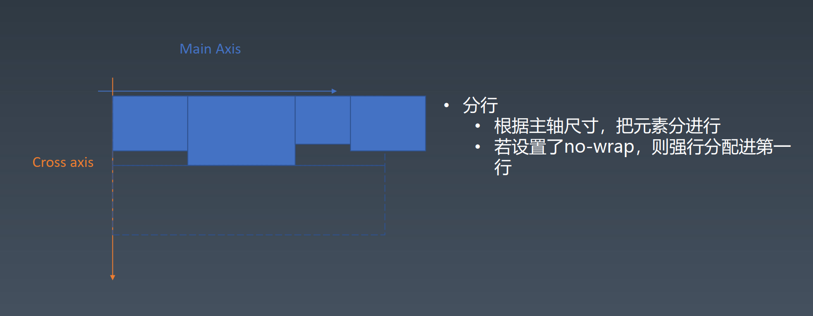

 
 # 盒
  <br>
 
 其实DOM树中存储的不全是元素，DOM树中存储的叫做节点（node），元素是节点的一种。比如文本节点它也是节点，但它并不是元素；注释节点它也是节点，它不是元素。还有像CDATA节点、processing-instruction、DTD这个都会存进DOM树里，但是它并不是元素。


CSS选择器选中的是元素或者伪元素。

CSS选择器选中的元素，它不一定跟盒是一一对应的关系，有可能是一对多的关系。

<br>

## 盒模型
  <br>


## 三代排版技术
- 第一代：基于正常流和正常流里的一些基础设施的排版
- 第二代：基于flex的排版 （主流）
- 第三代：基于grid的排版
- 第3.5代：CSS Houdini带来的一种完全自由的可以拿JS干预的排版

在CSS排版里，其实只排两样东西，第一样叫做盒，第二样叫做文字。

<br>

# 正常流

## 正常流排版
- 收集盒进行
- 计算盒在行中的排布
- 计算行的排布

## IFC BFC
BFC: block-level-formatting-context 块级格式化上下文 <br>
IFC: inline-level-formatting-context 行内级格式化上下文

  <br>

<br>

# 正常流的行级排布

## 行模型
  <br>

- base-line : 基线，英文字母用来对齐的线
- text-top、text-bottom : 只要字体大小不变，text-top和text-bottom不会变的。如果用了多种字体混排，text-top和text-bottom由fontSize最大的一个字体决定的
- line-top、line-bottom : 当行高大于文字高度的时候，会有line-top、line-bottom。当其他盒足够高时，line-top可能会被撑开。盒的先后顺序和盒的尺寸都可能会影响line-top、line-bottom的位置，但盒不会影响text-top、text-bottom。

<br>

# 正常流的块级排布
float的一个显著特征就是它会影响生成行盒的尺寸。float元素不止影响自己所在的这一行，凡是它的高度占据的范围类，所有的行盒都会根据float元素的尺寸调整自己的大小。

clear：它是找一个干净的空间来执行浮动的意思。clear：right就是找到右边一块干净的空间来执行浮动。

br对float无效，不会换行。float换行可以用clear。

float有时候会发生重排的行为，所以不太建议频繁的去使用float，只建议在实现文字绕排的时候使用float。尤其是现在有了第二代排版技术和第三代排版技术的情况下，我们基本上不需要使用float去做正常的排版。

## margin折叠
  ==>    <br>

在BFC里，2个都有margin的元素，不会把两个margin都留出来，而是会发生折叠。折叠后的高度，是跟最大的margin的高度相等的。这个现象叫Margin Collapse，即margin折叠。

要注意，margin折叠（Margin Collapse）只会发生在BFC里，不会发生在IFC、flex、grid里面。正常流只有BFC会发生margin折叠。

<br>

# BFC合并

## Block
- Block Container： 里面有BFC的盒
   - 能容纳正常流的盒， 里面就有BFC， 想想有哪些？
- Block-level Box： 外面有BFC的盒
   - 正常流里一共有两种Formatting Context，一种是BFC，一种是IFC。文字只能放进IFC。来了一个盒，要么把它放进里层的IFC里，要么放进外层的BF里，没有其他选项，如果没有IFC，那么创建一个新的IFC。
- Block Box = Block Container + Block-level Box，既是Block Container，也是Block-level Box。就是里外都有BFC的
   - ***（重要考点）***

## Block Container
   - block
   - inline-block
   - table-cell
   - flex item
      - display为flex的元素不是Block Container。但是它的子元素flex item，如果没有特殊的display，都是Block Container
   - grid cell
   - table-caption   

所有能够容纳里边不是特殊的display模式的，它里边默认就是正常流。   

## Block-level Box
- Block level
   - display:block
   - display: flex
   - display: table
   - display: grid
   - ......

- Inline level   
   - display: inline-block
   - display: inline-flex
   - display: inline-table
   - display: inline-grid
   - ......

## 设立BFC 
（什么时候什么样的盒会创建BFC）<br>
- floats （浮动元素会创建BFC）
- absolutely positioned elements （绝对定位的元素里边会创建BFC）
- block containers (such as inline-blocks, table-cells, and table-captions) that are not block boxes,
   - flex items
   - grid cell
   - ......
- and block boxes with 'overflow' other than 'visible'

默认能容纳正常流的盒，我们都认为它会创建BFC。但是有一种情况例外：Block Box里外都是BFC且overflow是visiable。

## BFC合并
- block box && overflow:visible 时，不会创建BFC，会发生BFC合并
- BFC 合并后的影响
   - BFC合并与float
      - 因为BFC发生了合并，所以里边的行盒跟这个float就有了一定的影响。
   - BFC合并与边距折叠
      - 存在同向的边距折叠

<br>

# Flex排版
- 收集盒进行
- 计算盒在主轴方向的排布
- 计算盒在交叉轴方向的排布   

  <br><br>
根据主轴尺寸， 把元素分进行分行。如果超出了行的宽度，就放进下一行。若设置了no-wrap，则强行分配进第一行。

 <br>

 


<br><br>

# 动画与绘制

css控制表现
1. 控制元素的位置和尺寸的信息
2. 控制绘制和最后的渲染信息
3. 交互与动画的信息


Animation
- 使用 @keyframes 定义动画的关键帧
- 使用animation属性去使用关键帧的部分

```
@keyframes mykf
{
  from {background: red;}
  to {background: yellow;}
}
div
{
  animation:mykf 5s infinite;
}
```


<br>

Animation
- animation-name 时间曲线
- animation-duration 动画的时长；
- animation-timing-function 动画的时间曲线；
- animation-delay 动画开始前的延迟；
- animation-iteration-count 动画的播放次数；
- animation-direction 动画的方向。（是正向播放还是倒着播放）

<br>

@keyframes 

可以使用百分比，也可以使用from to, from相当于0%，to相当于100%
```
@keyframes mykf {
  0% { top: 0; transition:top ease}
  50% { top: 30px;transition:top ease-in }
  75% { top: 10px;transition:top ease-out }
  100% { top: 0; transition:top linear}
}
```


<br>

- transition 使用
- transition-property 要变换的属性；
- transition-duration 变换的时长；
- transition-timing-function 时间曲线；
- transition-delay 延迟。

贝塞尔曲线

<br>

# 渲染与颜色

HSL

<br>

# 绘制
- 几何图形
   - border
   - box-shadow
   - border-radius
- 文字
   - font
   - text-decoration
- 位图
   - background-image

不推荐用border、border-radius等拼其他图形，比如五角星等。

推荐使用data uri + svg。因为我们可以使用background-image，可以把svg变成data uri，在所有我们需要图片的地方，我们都可以使用inline的svg去描绘这个图片。

### 应用技巧
- data uri + svg
- data:image/svg+xml,\<svg width="100%" height="100%" version="1.1"
xmlns="http://www.w3.org/2000/svg">\<ellipse cx="300" cy="150"
rx="200" ry="80" style="fill:rgb(200,100,50);
stroke:rgb(0,0,100);stroke-width:2"\/> \</svg>
