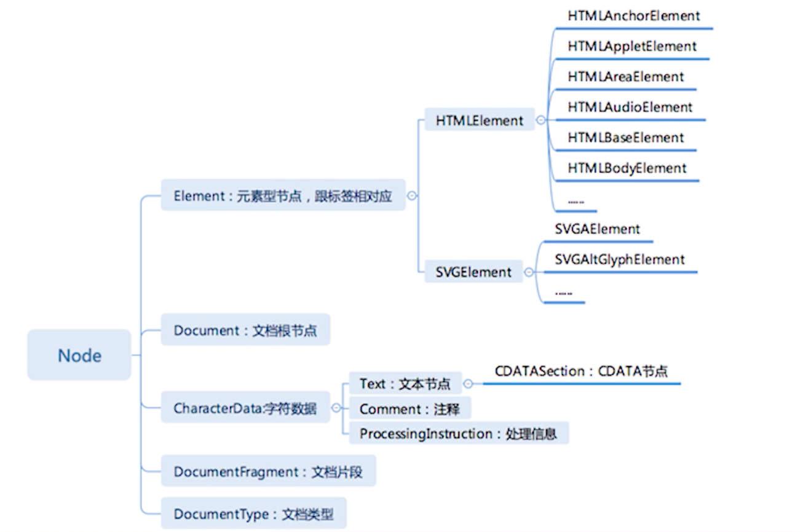
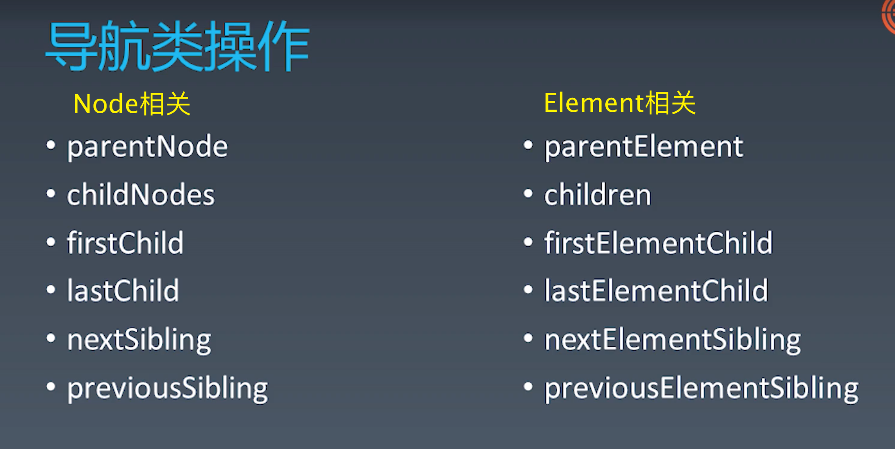
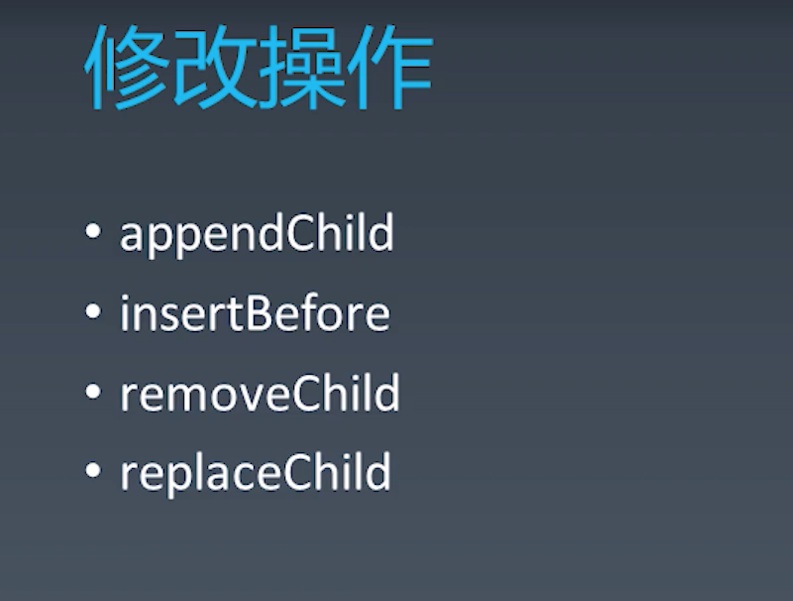
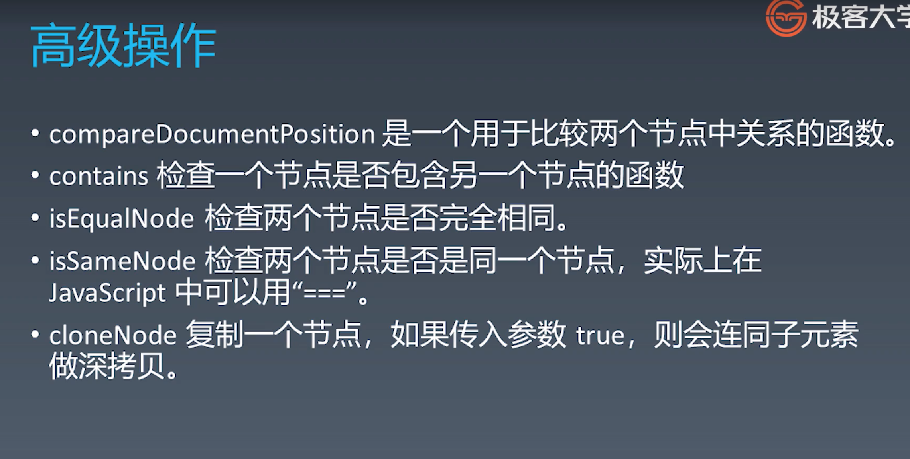

在HTML里，普通的空格多个会被合成一个。

不推荐使用nbsp来代替空格，它叫no break space，它在连接之后，并不把单词分开，它把两个词连成一个词。当我们使用nbsp去连接两个词的时候，会把它认为是一个词，破坏了一定的语义。

如果想要出现多个空格，推荐使用css里的white-space属性让空格被显示出来。

- quot 双引号  &nbsp;&nbsp;&nbsp;  \&quot;  ==> &quot; 
- amp &符号   &nbsp;&nbsp;&nbsp;  \&amp;  ==> &amp; 
- lt  小于号   &nbsp;&nbsp;&nbsp;  \&lt; ==> &lt; 
- gt  大于号   &nbsp;&nbsp;&nbsp;  \&gt; ==> &gt;
- apos 单引号  &nbsp;&nbsp;&nbsp;  \&apos; ==> &apos;

使用都是 &+字符+分号 

四种namespace
- HTML
- XHTML
- MathML
- SVG

 

# HTML语法

## 合法元素
1. Element: \<tagname>...\</tagname>
   - startTag和endTag的组合
2. Text: text
   - 文本节点
3. Comment: \<!-- commnents --> 
   - 注释节点
4. DocumentType: <!Doctype html>
5. ProcessingInstruction: \<?a 1?>
   - 预处理的语法 (不常用)
6. CDATA: \<![CDATA[ ]]>
   - CDATA节点，其实只是一种特殊的语法，它产生的也是文本节点，不过CDATA节点里支持的文本不需要再考虑转义的问题了。CDATA节点是文本的另一种语法表达。

 ## 字符引用
 - \&#33; &nbsp;&nbsp; &+#+数字;  &nbsp;&nbsp;&nbsp;  ：代表ASCII码33的字符
 - \&amp;  &nbsp;&nbsp;&nbsp; &符号
 - \&lt;  &nbsp;&nbsp;&nbsp; 小于号
 - \&quot;  &nbsp;&nbsp;&nbsp; 双引号

 

# 事件API
在所有的节点都可以使用addEventListener() API

## EVent：冒泡与捕获
事件的冒泡和捕获，跟是否监听是没有关系的。冒泡和捕获，在任何一次事件触发的过程中，两个过程都会发生，不管是否监听这个事件，不加addEventListener()监听，这个过程也会发生。冒泡和捕获的过程是浏览器自己去处理事件的一套机制。

任何一个事件，都是**先捕获再冒泡的过程**。因为我们要先从外到内一层一层去计算，到底这个事件发生在哪个元素上，这样一个过程叫捕获。而冒泡，是我们已经算出来事件发生在哪个元素上，层层的向外去触发，让元素去响应这个事件的过程。

同一个元素，冒泡先添加的先触发

 

# DOM API

浏览器API，有很多种类，DOM是其中最重要的种类，浏览器API百分之七八十都是DOM API。

BOM，浏览器对象模型，BOM只是很小的一组API，并不包含DOM API。

 

DOM API分成了4个部分
- 节点API
- 事件API
- Range API （相比节点API，能更精确的操作DOM树，性能也更好）
- traversal系列API（废弃，不推荐使用）

## Node
  

DocumentFragment,文档片段，它没有办法挂到任何一颗DOM树上。但是它也继承了Node节点，它也可以执行挂在DOM树上的操作，只不过它挂的时候会把自己所有的子节点给它塞到上面。经常跟Range API 搭配使用。

HTML里面至少有3个常用的nameSpace，分别是：HTML、SVG和MathML。

a标签叫HTMLAnchorElement，其他都是HTML+名称+Element

   
   
   

在做html的节点或者html的模板，这样的场景，我们可以用cloneNode去大量的复制，它的速度也非常快。

 

# Range API
在DOM里面，Range的意思是一个范围，我们可以理解为它是HTML文档流里面的有起始点和终止点的一段范围。Range是不能跳的，每一个Range一定是一个连续的范围。Range的起点，只要它在DOM树里的位置是先于终点的就可以，不需要管层级关系，比如：起点可能位于前一个节点的三层子节点里面，而终点位于后一个节点后边。起止点都是由一个element和一个偏移值来决定的。对于element，它的偏移值就是children；对于text node来说，偏移值就是文字的个数。

Range不一定是包含了一个完整的节点，它可以包含半个节点。它包含节点不需要去顾忌节点跟节点之间的边界。Range选择的范围非常灵活，在DOM树上，它可以任意的选择一段。

 

## 创建range
- var range = new Range()
- range.setStart(element, 9)
- range.setEnd(element, 4)
- var range = document.getSelection().getRangeAt(0);

 

除了我们手动的指定起始点的方法，还有一种方式就是从selection创建Range。Selection就是我们拿鼠标在屏幕上圈中的地方，当有selection的时候，可以getSelection().getRangeAt(0)。

 

便捷操作
- range.setStartBefore
- range.setEndBefore
- range.setStartAfter
- range.setEndAfter
- range.selectNode
- range.selectNodeContents

