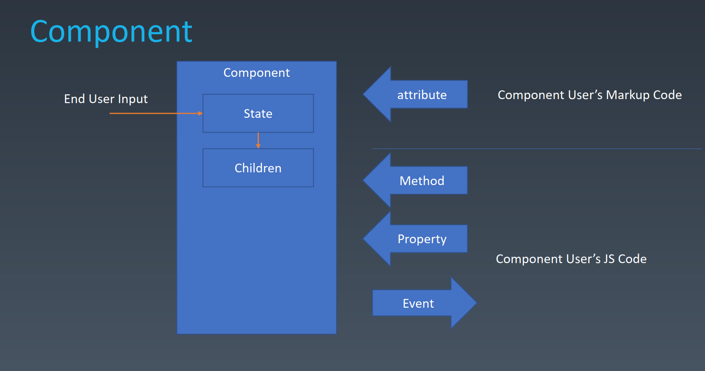
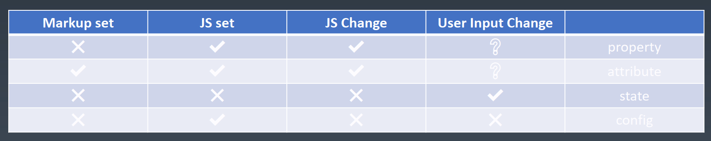
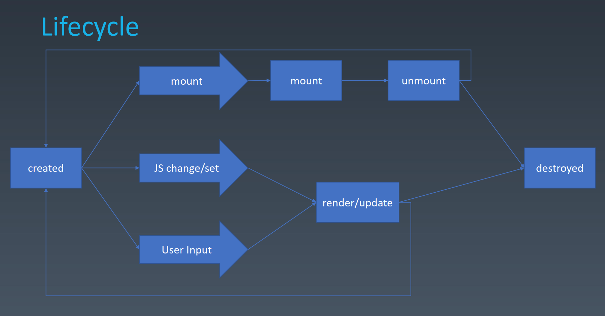

# 组件的基本概念和基本组成部分
## 对象与组件
对象
- Properties （属性）
- Methods （方法）
- Inherit （继承关系）

<br>

组件
- Properties
- Methods
- Inherit
- Attribute
- Config & State
- Event  （event是组件往外传递东西）
- Lifecycle
- Children （Children是树形结构的必要性）

## component
  <br><br>

event是开发组件的人向使用组件的程序员传递信息

## Attribute
- Attribute vs Property
   - Attribute 强调描述性
   - Property 强调从属关系


<br>

## Attribute vs Property
HTML就是一个典型的property和attribute两者不等效的这样的一个系统。

```
Attribute:

<my-component attribute=“v” />
myComponent.getAttribute(“a”)
myComponent.setAttribute(“a”,“value”);

Property:

myComponent.a = “value”;
```

```
<div class="cls1 cls2"></div>
<script>
  var div = document.getElementByTagName(‘div’);
  div.className // cls1 cls2
</script>

// attribute里是class，但是property里变成了className
// 现在JavaScript语言已经没有这个问题了，div.class也是可以的，但是HTML还是还是不支持class这个名字（html不支持class是什么意思？）
```

```
<div class="cls1 cls2" style="color:blue" ></div>
<script>
  var div = document.getElementByTagName('div');
  div.style  // --> 这里是对象
</script>

// attribute是字符串，但是property是对象
```

```
<a href="//m.taobao.com" ></div>
<script>
  var a = document.getElementByTagName('a’);
  a.href  // “http://m.taobao.com”， 这个 URL 是 resolve 过的结果 （property）
  a.getAttribute(‘href’)  // “//m.taobao.com”， 跟 HTML 代码中完全一致 （attribute）
</script>

// 关于href这个属性，property是经过resolve过的URL
```

```
<input value = "cute" />
<script>
  var input = document.getElementByTagName(‘input’); // 若 property 没有设置，则结果是 attribute
  input.value                 // cute
  input.getAttribute(‘value’); // cute
  input.value = ‘hello’;    // 若 value 属性已经设置，则 attribute 不变， property 变化，元素上实际的效果是 property 优先
  input.value              // hello
  input.getAttribute(‘value’); // cute
</script>

// 这里input的value是一个很著名的坑，JQuery提供了val()方法避免了这个问题
```
<br>

## 如何设计组件状态
  <br><br>

property：不能被markup标签去设置，不能被这种静态声明去设置。但是可以被JS去设置，也可以被JS改变。大部分情况下，property不应该由用户输入去改变。

attribute：可以被markup、JS去设置，JS去改变。大部分情况下，用户输入不会去改变attribute。

state：state有一个很大的特点，它只能从组件内部去改变。就是组件设计者不会给组件使用者一个能力去改变组件state。但是要保证用户输入能改变state，比如用户点了一个tab，哪个tab被激活了，这个一般是通过state去控制的。

config：config是个一次性的结果，它只有在组件构造的时候会触发，它能够一次性的被传进来，它是不可更改的。因为config这种不可更改性，通常会把config留给全局。


<br>

## 组件生命周期（Lifecycle）

  <br><br>


<br>

## Children
- Content型Children 与 Template型Children
   - Content型Children: 有几个children就显示出来几个children
   - Template型Children：children充当模板作用，不能反映实际的children个数。比如list的话，children模板可能被复制10份，那么就有10个children。

```
<my-button>{{title}}</my-button>

<my-list>
  <li>{{title}}</li>
</my-list>
```


<br><br>

# 为组件添加JSX语法
   